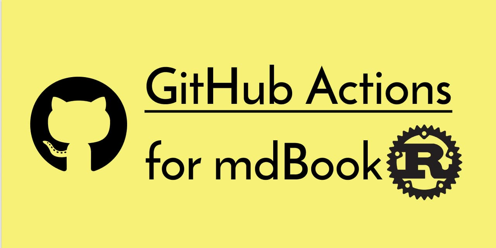

[](https://github.com/peaceiris/actions-mdbook/blob/master/LICENSE)
[](https://github.com/peaceiris/actions-mdbook/releases/latest)
[](https://github.com/peaceiris/actions-mdbook/releases)

[](https://www.codefactor.io/repository/github/peaceiris/actions-mdbook)
[](https://codecov.io/gh/peaceiris/actions-mdbook)
[](https://github.com/peaceiris/actions-mdbook/releases.atom)
[](https://dependabot.com)




## GitHub Actions for mdBook

[rust-lang/mdBook] Setup Action.

[rust-lang/mdBook]: https://github.com/rust-lang/mdBook

We can run **mdBook** on a virtual machine of **GitHub Actions** by this mdBook action.
Linux, macOS, and Windows are supported.

| OS (runs-on) | ubuntu-18.04 | macos-latest | windows-2019 |
|---|:---:|:---:|:---:|
| Support | ✅️ | ✅️ | ✅️ |


## Table of Contents

<!-- START doctoc generated TOC please keep comment here to allow auto update -->
<!-- DON'T EDIT THIS SECTION, INSTEAD RE-RUN doctoc TO UPDATE -->


- [Getting Started](#getting-started)
  - [⭐️ Create your workflow](#%EF%B8%8F-create-your-workflow)
- [Options](#options)
  - [⭐️ Use the latest version of mdBook](#%EF%B8%8F-use-the-latest-version-of-mdbook)
- [Tips](#tips)
  - [⭐️ Read mdBook version from file](#%EF%B8%8F-read-mdbook-version-from-file)
- [CHANGELOG](#changelog)
- [License](#license)
- [About Maintainer](#about-maintainer)
- [Maintainer Notes](#maintainer-notes)

<!-- END doctoc generated TOC please keep comment here to allow auto update -->


## Getting Started

### ⭐️ Create your workflow

An example workflow `.github/workflows/gh-pages.yml` with [GitHub Actions for GitHub Pages]

[GitHub Actions for GitHub Pages]: https://github.com/peaceiris/actions-gh-pages

[](https://github.com/peaceiris/actions-gh-pages)


```yaml
name: github pages

on:
  push:
    branches:
      - master

jobs:
  build-deploy:
    runs-on: ubuntu-18.04
    steps:
      - uses: actions/checkout@v2

      - name: Setup mdBook
        uses: peaceiris/actions-mdbook@v1
        with:
          mdbook-version: '0.3.5'
          # mdbook-version: 'latest'

      - run: mdbook build

      - name: Deploy
        uses: peaceiris/actions-gh-pages@v3
        with:
          github_token: ${{ secrets.GITHUB_TOKEN }}
          publish_dir: ./book
```

<div align="right">
<a href="#table-of-contents">Back to TOC ☝️</a>
</div>


## Options

### ⭐️ Use the latest version of mdBook

Set `mdbook-version: 'latest'` to use the latest version of mdBook.

```yaml
- name: Setup mdBook
  uses: peaceiris/actions-mdbook@v1
  with:
    mdbook-version: 'latest'
```

This action fetches the latest version of mdBook by [mdbook — Homebrew Formulae](https://formulae.brew.sh/formula/mdbook)

<div align="right">
<a href="#table-of-contents">Back to TOC ☝️</a>
</div>


## Tips

### ⭐️ Read mdBook version from file

How to sync a mdBook version between a Docker Compose and a GitHub Actions workflow via `.env` file.

Write a `MDBOOK_VERSION` to the `.env` file like the following and push it to a remote branch.

```sh
MDBOOK_VERSION=0.3.5
```

Next, add a step to read a mdBook version from the `.env` file.

```yaml
    - name: Read .env
      id: mdbook-version
      run: |
        . ./.env
        echo "::set-output name=MDBOOK_VERSION::${MDBOOK_VERSION}"

    - name: Setup mdBook
      uses: peaceiris/actions-mdbook@v1
      with:
        mdbook-version: '${{ steps.mdbook-version.outputs.MDBOOK_VERSION }}'
```

Here is a `docker-compose.yml` example.

```yaml
version: '3'

services:
  mdbook:
    container_name: mdbook
    image: "peaceiris/mdbook:v${MDBOOK_VERSION}"
    # image: "peaceiris/mdbook:v${MDBOOK_VERSION}-rust"  # Large image including Rust compiler
    stdin_open: true
    tty: true
    ports:
      - 3000:3000
      - 3001:3001
    volumes:
      - ${PWD}:/book
    command:
      - serve
      - --hostname
      - '0.0.0.0'
```

The alpine base mdBook Docker image is provided on the following repository.

> [peaceiris/docker-mdbook: mdBook Alpine Base Docker Image.](https://github.com/peaceiris/docker-mdbook)

<div align="right">
<a href="#table-of-contents">Back to TOC ☝️</a>
</div>


## CHANGELOG

- [CHANGELOG.md](CHANGELOG.md)


## License

- [MIT License - peaceiris/actions-mdbook]

[MIT License - peaceiris/actions-mdbook]: https://github.com/peaceiris/actions-mdbook/blob/master/LICENSE


## About Maintainer

- [peaceiris homepage](https://peaceiris.com/)


## Maintainer Notes

Run `npm` and `git commit` commands on a container.

**On Host**

```sh
# Docker
make build
make run
make run cmd="env"
make test
make commit msg="chore: Add Makefile"

# Release
./release.sh
```


<div align="right">
<a href="#table-of-contents">Back to TOC ☝️</a>
</div>
